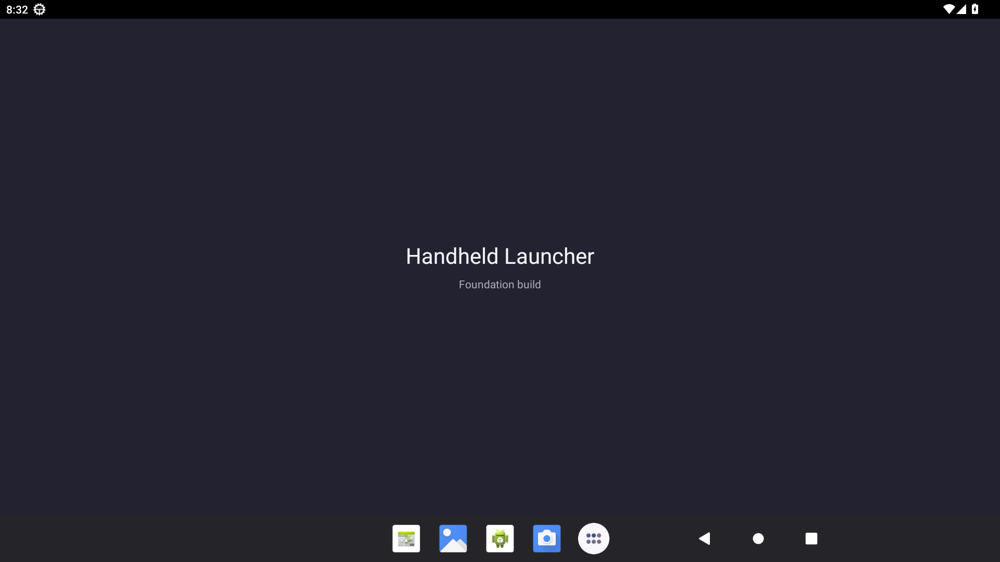

# F01 final gate

Coordinator acceptance, 7 September 2026. US-001, US-002 and US-003 are accepted. Independent Sol review found no remaining blocking issue; coordinator also inspected the Activity claim implementation and concurrency tests.

The final build command and detailed results are recorded in [US-003](US-003.md): debug assembly, lint, independent design-system compilation, 15 domain tests and 7 app tests passed. All 22 tests have zero failures, errors or skips. App lint reports zero errors and 48 warnings; these have not been suppressed. Data/design-system lint reports no issues.

The coordinator installed the final APK on the isolated Android 13 emulator (`emulator-5556`, 1920×1080, 240 dpi). Installation succeeded, a force-stopped cold launch returned `Status: ok`, and returning through native Home then bringing the existing task forward also returned `Status: ok`. `topResumedActivity` was `dev.handheld.launcher/.MainActivity`; the cleared-and-rechecked AndroidRuntime error log was empty. The final screenshot was inspected.

APK SHA-256: `813909f03a5e6ccb382d86a6ad5329a9d0a88dbb9be62072b161fcceed85e286`.

F02/US-004 and F06/US-017 are now eligible to implement in parallel against the published [contracts](../../contracts.md), with one writer per feature. Shared build, domain, app integration and status files return to coordinator ownership. This acceptance covers the ordinary foundation Activity; physical Flip 2 calibration/controller/lid checks and real HOME behavior remain later gates.
