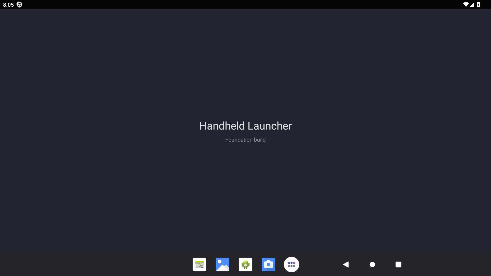

# US-001 ordinary Activity launch

Coordinator smoke test, 7 September 2026. APK: `app/build/outputs/apk/debug/app-debug.apk`, produced by the successful US-001 debug build. Environment: [isolated Android 13 emulator](emulator-environment.md), serial `emulator-5556`.

| Check | Command | Actual result |
| --- | --- | --- |
| Install | `adb -s emulator-5556 install -r app/build/outputs/apk/debug/app-debug.apk` | `Success` |
| Ordinary Activity launch | `adb -s emulator-5556 shell am start -W -n dev.handheld.launcher/.MainActivity` | `Status: ok`, `LaunchState: COLD`, expected Activity |
| Live application | `adb -s emulator-5556 shell pidof dev.handheld.launcher` | PID 2811 |
| Foreground Activity | `adb -s emulator-5556 shell dumpsys activity activities` | `topResumedActivity` is `dev.handheld.launcher/.MainActivity` |
| Runtime errors | `adb -s emulator-5556 logcat -d -s AndroidRuntime:E` | No error output |
| Visible content | ADB screenshot, inspected by coordinator | Centered “Handheld Launcher” and “Foundation build”; ordinary Android system UI remains visible |

US-001 AC-02 passes on the Android 13 emulator. This test does not validate a HOME role, final shell, physical controller, Flip 2 firmware, or display calibration. Those later checks remain pending. Emulator launch timings are not product performance measurements.
