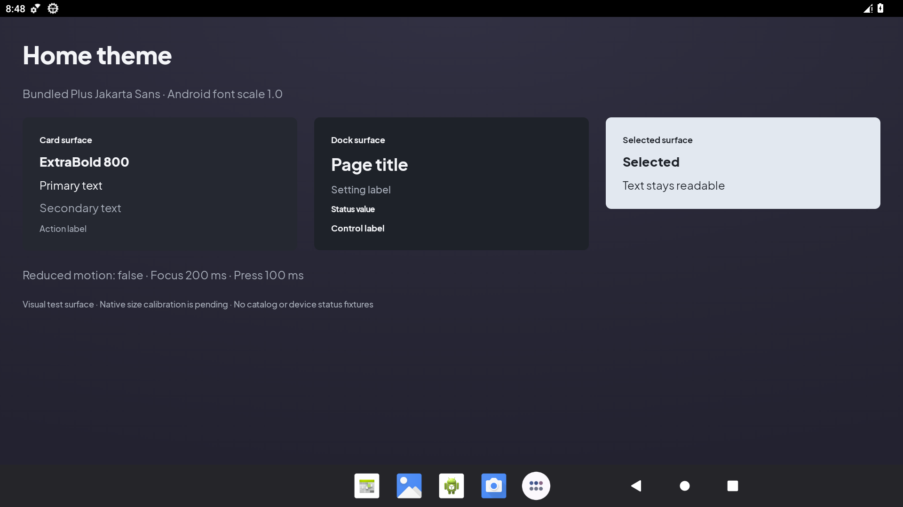
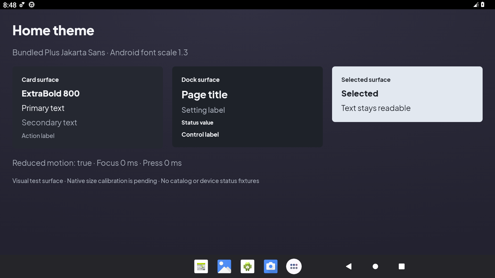
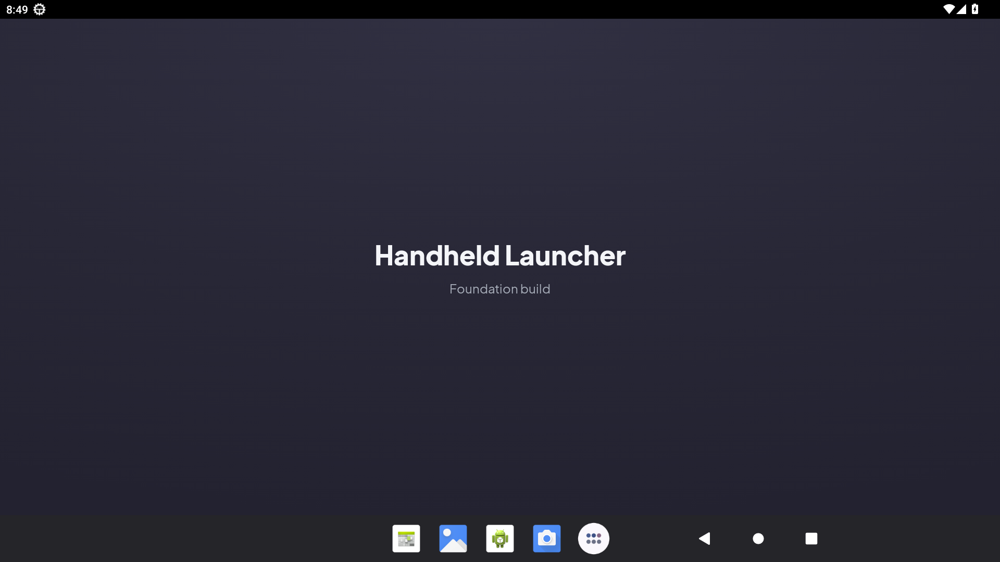

# US-004 theme implementation and acceptance evidence

Accepted by coordinator on 7 September 2026 against F01 baseline `ce09ddc`. Luna/medium implemented the theme and fonts; the coordinator integrated the exact elliptical shader, ordinary Activity consumer and debug-only sampling Activity. Independent Terra/medium review found no remaining blocker.

## Acceptance mapping

| Criterion | Actual evidence | Result |
| --- | --- | --- |
| AC-01 | Actual `docs/references/home.png` inspected; app-content crop x32–1426/y21–805 excludes editor surroundings. Home alone defines shell geometry; [preparation](preparation.md) records proportions. | Passed |
| AC-02 | Typed colors/type/spacing/shapes/depth/motion; bounds-aware Home elliptical radial shader; native samples and contrast checks below. | Passed |
| AC-03 | Cold Activity launch with emulator Wi-Fi/mobile data disabled; five static TTF resources and OFL notice verified inside APK. | Passed |
| AC-04 | Actual Android font scale 1.0 versus 1.3 renders; animator scale 0 resolves theme focus/press durations to 0. Native text remains readable without bitmap scaling. | Passed |

Typography uses locally bundled Plus Jakarta Sans static weights 400, 500, 600, 700, and explicit 800. Font/notice hashes match [upstream provenance](preparation.md). The APK contains all five `res/font/plus_jakarta_sans_*.ttf` files and `assets/font-notices/PlusJakartaSans-OFL.txt` (4,402 bytes).

The upstream notice is preserved byte-for-byte, including its one trailing space on line 21; the source whitespace check excludes only that third-party notice.

`LauncherTheme(reducedMotion, content)` exposes typed semantic groups. The shader uses actual drawing bounds, center 50%/0%, radii 120% width/100% height, and stops 0%/55%/100%, matching Home's source recipe. It has no fixed pixel viewport or circular approximation. The app refreshes `!ValueAnimator.areAnimatorsEnabled()` on resume; durations derive from this value. Theme code has no app/domain or sensor dependency.

## Native rendering and contrast

Emulator: isolated Android 13 `emulator-5556`, 1920×1080, 240 dpi. Wi-Fi and mobile data both reported 0 during offline renders. Cold launches returned `Status: ok`; AndroidRuntime error logs were empty. Screenshots were inspected by the coordinator.





The large-font sample remains readable with separate labels and no clipping. It displays the actual Compose font scale and theme motion values: default 1.0/false/200ms/100ms; changed 1.3/true/0ms/0ms. These debug values do not appear in product flows. `ThemePreviewActivity` is absent from the merged release manifest.

Essential opaque text contrast ratios: primary/background top 11.80:1; secondary/background top 5.65:1; primary/secondary on card 13.50:1/6.46:1; on dock 14.64:1/7.00:1; selected content/surface 12.94:1. Actual default screenshot samples confirmed card `#252831` at (100,265), dock `#1E2229` at (690,265), selected `#E2E8F0` at (1300,265), and gradient bottom `#232230` at (960,985). The top sample at (960,40) is interpolated `#302F41`, no brighter than the background-top token used for the conservative ratio. Essential text uses primary/secondary roles; the lower-contrast reference muted role is not used for essential labels.

## Build and integration

With JBR 17 and the documented process-local Windows socket workaround:

```powershell
.\gradlew.bat --no-daemon :core:designsystem:compileDebugKotlin
.\gradlew.bat --no-daemon assembleDebug lintDebug :core:domain:test :app:testDebugUnitTest :app:processReleaseMainManifest
```

Focused design-system compilation passed in 18s. Combined final gate passed in 34s (151 actionable tasks: 69 executed, 8 from cache, 74 up-to-date). All 22 domain/app JVM tests pass with zero failures/errors/skips. Lint reports zero errors; app retains 48 documented warnings, data/design-system report no issues. Separate US-017 actual Room tests passed 8/8 on the same emulator.

Final APK SHA-256: `d34ac5e92d3d9b00c8f99fe8b3efc53ca05127412d29e1c53568fd41855ee557`. Merged release manifest contains neither the preview Activity nor an Internet permission. Emulator font scale was restored to the effective default 1.0, animator scale to its original unset value, and Wi-Fi/mobile data to 1, followed by a successful ordinary MainActivity cold launch.



Native defaults remain provisional: the approximate 1280-unit reference coordinate system is compared with 1920px at 240dpi (1280dp width), not declared a measured Flip 2 density. US-005 owns root metrics and further size calibration; US-006 owns primitives. Physical Flip 2, final shell, controller, lid and HOME behavior are not accepted by these theme screenshots.
